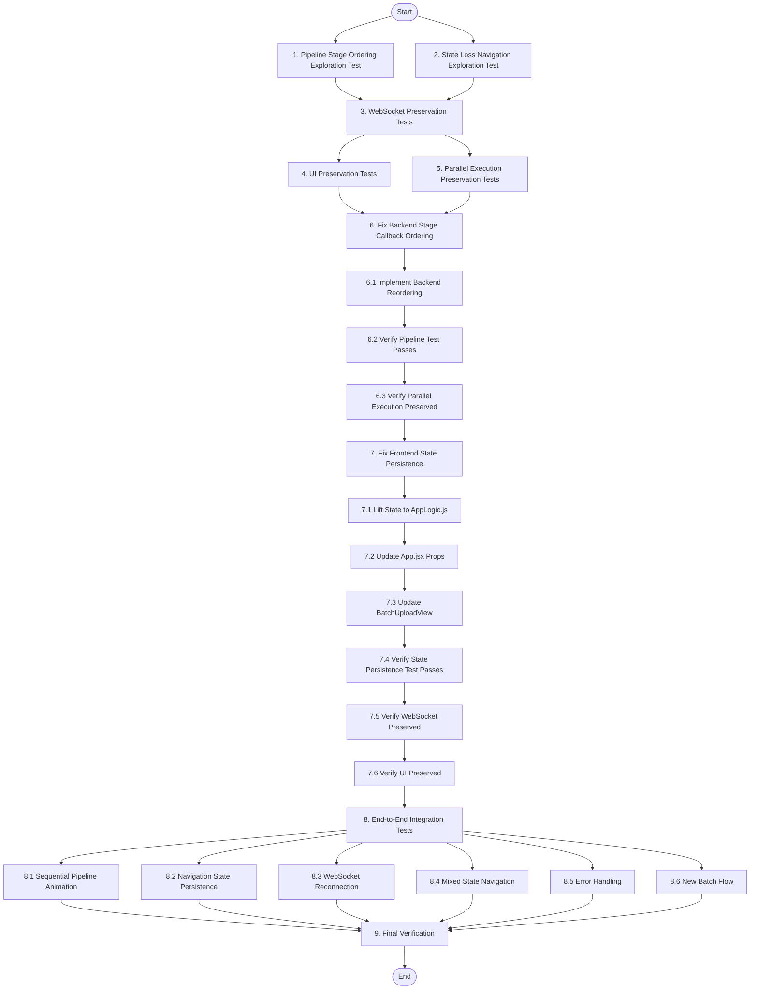

# Implementation Plan

## Overview

This task list implements fixes for two critical bugs in the batch resume processing dashboard:
1. **Pipeline Animation Inconsistency**: Backend stage callbacks fire out of order (0, 1, 3, 2, 4, 5, 6, 7)
2. **State Loss on Navigation**: Batch state is lost when navigating to detail view and back

The implementation follows the exploratory bugfix workflow: Explore → Preserve → Implement → Validate

---

## Tasks

- [x] 1. Write bug condition exploration test for pipeline stage ordering
  - **Property 1: Bug Condition** - Backend Stage Callback Sequential Order
  - **CRITICAL**: This test MUST FAIL on unfixed code - failure confirms the bug exists
  - **DO NOT attempt to fix the test or the code when it fails**
  - **NOTE**: This test encodes the expected behavior - it will validate the fix when it passes after implementation
  - **GOAL**: Surface counterexamples that demonstrate stage callbacks fire out of order
  - **Scoped PBT Approach**: Test with concrete batch job scenarios (1 resume, 3 resumes, 5 resumes) to ensure reproducibility
  - Create test file: `backend/test_stage_ordering.py`
  - Mock `stage_callback` function to capture call order
  - Call `execute_scan_job` with test resume data
  - Assert stage callbacks are called in order [0, 1, 2, 3, 4, 5, 6, 7]
  - **EXPECTED OUTCOME**: Test FAILS with actual order [0, 1, 3, 2, 4, 5, 6, 7] (confirms bug exists)
  - Document counterexamples: "Stage callback 3 (Skill Graph) fires before stage callback 2 (Blind Score)"
  - Verify parallel execution optimization is active (skill graph + blind scoring run concurrently)
  - Mark task complete when test is written, run, and failure is documented
  - _Requirements: 1.3, 2.3_

- [x] 2. Write bug condition exploration test for state loss on navigation
  - **Property 1: Bug Condition** - Batch State Persistence Across Navigation
  - **CRITICAL**: This test MUST FAIL on unfixed code - failure confirms the bug exists
  - **DO NOT attempt to fix the test or the code when it fails**
  - **NOTE**: This test encodes the expected behavior - it will validate the fix when it passes after implementation
  - **GOAL**: Surface counterexamples that demonstrate jobs state is lost during navigation
  - **Scoped PBT Approach**: Test with concrete scenarios (5 completed jobs, 3 completed + 2 in-progress, 1 error + 4 completed)
  - Create test file: `frontend/src/components/BatchUploadView.navigation.test.jsx`
  - Render BatchUploadView with 5 mock jobs in completed state
  - Simulate navigation: call `onViewResult(jobs[0])` to navigate to detail view
  - Simulate back navigation: re-render BatchUploadView component
  - Assert jobs array still contains 5 jobs
  - **EXPECTED OUTCOME**: Test FAILS with jobs array empty (confirms bug exists)
  - Document counterexamples: "After navigation to results and back, jobs.length === 0 instead of 5"
  - Verify component unmounts during navigation (use React DevTools or mount/unmount lifecycle tracking)
  - Mark task complete when test is written, run, and failure is documented
  - _Requirements: 1.5, 1.6, 2.5, 2.6_

### Phase 1: Exploration Tests (BEFORE Fix)

- [ ] 3. Write preservation property tests for WebSocket and real-time updates
  - **Property 2: Preservation** - WebSocket Connection and Real-Time Updates
  - **IMPORTANT**: Follow observation-first methodology
  - Observe: WebSocket connects on batch upload, sends heartbeat pings every 30s, reconnects with exponential backoff on disconnect
  - Observe: Real-time job updates arrive via WebSocket messages with `job_id`, `status`, `stage`, `result` fields
  - Create test file: `frontend/src/components/BatchUploadView.websocket.test.jsx`
  - Write property-based test: for all batch uploads, WebSocket connection is established and heartbeat mechanism works
  - Write property-based test: for all job updates, WebSocket messages trigger state updates in jobs array
  - Write property-based test: for all WebSocket disconnections, exponential backoff reconnection is attempted
  - Run tests on UNFIXED code
  - **EXPECTED OUTCOME**: Tests PASS (confirms baseline WebSocket behavior to preserve)
  - Mark task complete when tests are written, run, and passing on unfixed code
  - _Requirements: 3.2_

- [~] 4. Write preservation property tests for UI interactions and display
  - **Property 2: Preservation** - UI Interactions and Visual Display
  - **IMPORTANT**: Follow observation-first methodology
  - Observe: Ranked results table displays completed resumes sorted by score descending
  - Observe: Clicking stage cubes filters jobs to show only those in that stage
  - Observe: Error states display red badges with error messages for failed jobs
  - Observe: File validation rejects non-PDF/JPG/PNG/WEBP files with error message
  - Observe: "New Batch" button clears jobs array and resets batch state
  - Observe: Progress bar shows percentage as (completed_jobs / total_jobs) * 100
  - Create test file: `frontend/src/components/BatchUploadView.ui.test.jsx`
  - Write property-based test: for all completed batches, ranked results are sorted by score descending
  - Write property-based test: for all stage cube clicks, only jobs in that stage are highlighted
  - Write property-based test: for all failed jobs, error badges and messages are displayed
  - Write property-based test: for all file uploads, invalid file types are rejected
  - Write property-based test: for all "New Batch" clicks, state is cleared and WebSocket is closed
  - Run tests on UNFIXED code
  - **EXPECTED OUTCOME**: Tests PASS (confirms baseline UI behavior to preserve)
  - Mark task complete when tests are written, run, and passing on unfixed code
  - _Requirements: 3.1, 3.3, 3.4, 3.5, 3.6_

- [~] 5. Write preservation property tests for parallel execution optimization
  - **Property 2: Preservation** - Parallel Execution Performance
  - **IMPORTANT**: Follow observation-first methodology
  - Observe: Skill graph generation and blind scoring run concurrently (not sequentially)
  - Observe: Total processing time for one resume is ~X seconds (measure on unfixed code)
  - Create test file: `backend/test_parallel_execution.py`
  - Write property-based test: for all batch jobs, skill graph and blind scoring execute in parallel
  - Write property-based test: for all batch jobs, total processing time is within expected range (not doubled)
  - Mock `generate_skill_graph` and `blind_score_resume` to track execution timing
  - Run tests on UNFIXED code
  - **EXPECTED OUTCOME**: Tests PASS (confirms parallel execution optimization is working)
  - Mark task complete when tests are written, run, and passing on unfixed code
  - _Requirements: 3.2 (performance preservation)_

### Phase 2: Preservation Tests (BEFORE Fix)

- [ ] 6. Fix backend stage callback ordering in main.py

  - [~] 6.1 Implement backend stage callback reordering
    - Open `backend/main.py` and locate `execute_scan_job` function (line 2386)
    - Identify stage callback 2 (Blind Score) at lines 2535-2538
    - Identify stage callback 3 (Skill Graph) at lines 2417-2420
    - Move stage callback 2 to fire BEFORE stage callback 3 (before parallel execution starts)
    - Add clear comments indicating logical stage order:
      ```python
      # Stage 2/8: Blind Scoring (callback sent before parallel execution)
      if stage_callback:
          await stage_callback(2)
      
      # Stage 3/8: Skill Graph Generation (callback sent before parallel execution)
      if stage_callback:
          await stage_callback(3)
      ```
    - Verify stage callback 7 at line 2760 is called exactly once (remove duplicate if present)
    - Ensure parallel execution optimization remains intact (skill graph + blind scoring still run concurrently)
    - _Bug_Condition: isBugCondition_Pipeline(execution) where execution.stage_callbacks_order == [0, 1, 3, 2, 4, 5, 6, 7]_
    - _Expected_Behavior: stage_callbacks_order == [0, 1, 2, 3, 4, 5, 6, 7] for all batch jobs_
    - _Preservation: Parallel execution optimization must remain active (Requirements 3.2)_
    - _Requirements: 1.3, 2.1, 2.2, 2.3, 2.4_

  - [~] 6.2 Verify pipeline stage ordering exploration test now passes
    - **Property 1: Expected Behavior** - Backend Stage Callback Sequential Order
    - **IMPORTANT**: Re-run the SAME test from task 1 - do NOT write a new test
    - The test from task 1 encodes the expected behavior
    - Run `pytest backend/test_stage_ordering.py -v`
    - **EXPECTED OUTCOME**: Test PASSES (confirms stage callbacks now fire in order [0, 1, 2, 3, 4, 5, 6, 7])
    - Verify test output shows all stage callbacks in sequential order
    - _Requirements: 2.1, 2.2, 2.3, 2.4_

  - [~] 6.3 Verify parallel execution preservation test still passes
    - **Property 2: Preservation** - Parallel Execution Performance
    - **IMPORTANT**: Re-run the SAME test from task 5 - do NOT write a new test
    - Run `pytest backend/test_parallel_execution.py -v`
    - **EXPECTED OUTCOME**: Test PASSES (confirms parallel execution optimization still works)
    - Verify processing time has not increased significantly
    - _Requirements: 3.2_

- [ ] 7. Fix frontend state persistence by lifting state to App.jsx

  - [~] 7.1 Lift batch state to AppLogic.js
    - Open `frontend/src/components/AppLogic.js`
    - Add batch state management to `useAppState` hook:
      ```javascript
      const [batchJobs, setBatchJobs] = useState([]);
      const [batchId, setBatchId] = useState(null);
      const [batchWs, setBatchWs] = useState(null);
      ```
    - Update `reset` function to clear batch state:
      ```javascript
      const reset = () => {
        // ... existing reset logic ...
        setBatchJobs([]);
        setBatchId(null);
        if (batchWs) {
          batchWs.close();
          setBatchWs(null);
        }
      };
      ```
    - Return batch state in the hook's return object:
      ```javascript
      return {
        // ... existing state ...
        batchJobs,
        setBatchJobs,
        batchId,
        setBatchId,
        batchWs,
        setBatchWs,
      };
      ```
    - _Bug_Condition: isBugCondition_StateLoss(navigation) where BatchUploadView.jobs.length > 0 AND BatchUploadView_remounted == true_
    - _Expected_Behavior: jobs state persists across navigation for all navigation events_
    - _Preservation: WebSocket connection and real-time updates must continue to work (Requirements 3.2)_
    - _Requirements: 1.5, 1.6, 2.5, 2.6_

  - [~] 7.2 Update App.jsx to pass batch state as props
    - Open `frontend/src/App.jsx`
    - Locate BatchUploadView component rendering (around line 395-402)
    - Pass batch state as props:
      ```jsx
      <BatchUploadView
        s={s}
        jobs={s.batchJobs}
        setJobs={s.setBatchJobs}
        batchId={s.batchId}
        setBatchId={s.setBatchId}
        ws={s.batchWs}
        setWs={s.setBatchWs}
        onViewResult={(job) => {
          s.setResult(job.result);
          s.setStep('results');
        }}
      />
      ```
    - _Requirements: 2.5, 2.6_

  - [~] 7.3 Update BatchUploadView to use props instead of local state
    - Open `frontend/src/components/BatchUploadView.jsx`
    - Replace local state declarations (around line 139):
      ```jsx
      // BEFORE:
      // const [jobs, setJobs] = useState([]);
      // const [batchId, setBatchId] = useState(null);
      // const [ws, setWs] = useState(null);
      
      // AFTER:
      const { jobs, setJobs, batchId, setBatchId, ws, setWs } = props;
      ```
    - Update component to accept these props in function signature
    - Remove WebSocket cleanup from useEffect unmount:
      ```jsx
      // BEFORE:
      // useEffect(() => {
      //   return () => {
      //     Object.values(pollersRef.current).forEach(clearInterval);
      //     if (ws) ws.close();  // Remove this line
      //   };
      // }, [ws]);
      
      // AFTER:
      useEffect(() => {
        return () => {
          Object.values(pollersRef.current).forEach(clearInterval);
          // WebSocket cleanup moved to "New Batch" button handler
        };
      }, []);
      ```
    - Update "New Batch" button handler to close WebSocket:
      ```jsx
      const handleNewBatch = () => {
        setJobs([]);
        setBatchError(null);
        if (ws) {
          ws.close();
          setWs(null);
        }
      };
      ```
    - _Requirements: 2.5, 2.6, 3.6_

  - [~] 7.4 Verify state persistence exploration test now passes
    - **Property 1: Expected Behavior** - Batch State Persistence Across Navigation
    - **IMPORTANT**: Re-run the SAME test from task 2 - do NOT write a new test
    - The test from task 2 encodes the expected behavior
    - Run `npm test -- BatchUploadView.navigation.test.jsx`
    - **EXPECTED OUTCOME**: Test PASSES (confirms jobs state persists across navigation)
    - Verify test output shows jobs.length === 5 after navigation
    - _Requirements: 2.5, 2.6_

  - [~] 7.5 Verify WebSocket preservation test still passes
    - **Property 2: Preservation** - WebSocket Connection and Real-Time Updates
    - **IMPORTANT**: Re-run the SAME test from task 3 - do NOT write a new test
    - Run `npm test -- BatchUploadView.websocket.test.jsx`
    - **EXPECTED OUTCOME**: Test PASSES (confirms WebSocket behavior unchanged)
    - Verify heartbeat mechanism, reconnection logic, and real-time updates still work
    - _Requirements: 3.2_

  - [~] 7.6 Verify UI preservation test still passes
    - **Property 2: Preservation** - UI Interactions and Visual Display
    - **IMPORTANT**: Re-run the SAME test from task 4 - do NOT write a new test
    - Run `npm test -- BatchUploadView.ui.test.jsx`
    - **EXPECTED OUTCOME**: Test PASSES (confirms UI behavior unchanged)
    - Verify ranked results, stage filtering, error display, file validation, and "New Batch" button all work correctly
    - _Requirements: 3.1, 3.3, 3.4, 3.5, 3.6_

### Phase 3: Implementation

- [ ] 8. End-to-end integration tests

  - [~] 8.1 Test full batch upload flow with sequential pipeline animation
    - Start backend server: `cd backend && python main.py`
    - Start frontend dev server: `cd frontend && npm run dev`
    - Upload batch of 3 test resumes (use test PDFs from `backend/test_data/`)
    - Observe pipeline visualizer in browser DevTools
    - Verify all 8 stage cubes light up sequentially for each resume: 0 → 1 → 2 → 3 → 4 → 5 → 6 → 7
    - Verify no cubes skip or light up out of order
    - Verify ranked results table displays all 3 resumes sorted by score
    - Document test results with screenshots
    - _Requirements: 2.1, 2.2, 2.3, 2.4, 3.1_

  - [~] 8.2 Test navigation flow with state persistence
    - Upload batch of 5 test resumes
    - Wait for all 5 to complete processing
    - Click "View →" button on first resume to navigate to detail view
    - Verify detail view displays resume report correctly
    - Click browser back button or navigate back to batch view
    - Verify all 5 resumes are still visible in batch list
    - Verify ranked results table still shows all 5 resumes sorted by score
    - Document test results
    - _Requirements: 2.5, 2.6, 3.1_

  - [~] 8.3 Test WebSocket reconnection during batch processing
    - Upload batch of 5 test resumes
    - Wait for 2 resumes to complete
    - Disconnect WebSocket (use browser DevTools Network tab to simulate offline)
    - Wait 10 seconds
    - Reconnect WebSocket (restore network connection)
    - Verify remaining 3 resumes continue processing
    - Verify stage updates resume correctly after reconnection
    - Verify all 5 resumes complete successfully
    - Document test results
    - _Requirements: 3.2_

  - [~] 8.4 Test mixed state navigation (partial completion)
    - Upload batch of 5 test resumes
    - Wait for exactly 2 resumes to complete (3 still in-progress)
    - Click "View →" on one completed resume
    - Navigate back to batch view
    - Verify 2 completed resumes are visible with "Done" badges
    - Verify 3 in-progress resumes are visible with "Processing" badges
    - Wait for remaining 3 to complete
    - Verify all 5 resumes show "Done" badges
    - Document test results
    - _Requirements: 2.5, 2.6_

  - [~] 8.5 Test error handling and state persistence
    - Upload batch with 1 invalid file (e.g., .txt file) and 4 valid PDFs
    - Verify invalid file shows error state with red badge
    - Verify 4 valid files process successfully
    - Navigate to detail view of one successful resume
    - Navigate back to batch view
    - Verify error state for invalid file is still displayed
    - Verify 4 successful resumes are still visible
    - Document test results
    - _Requirements: 3.4_

  - [~] 8.6 Test "New Batch" flow and state cleanup
    - Upload batch of 3 test resumes
    - Wait for all 3 to complete
    - Click "New Batch" button
    - Verify jobs array is cleared (batch list is empty)
    - Verify WebSocket connection is closed (check browser DevTools Network tab)
    - Upload new batch of 2 test resumes
    - Verify fresh state with only 2 new resumes
    - Verify pipeline animation works correctly for new batch
    - Document test results
    - _Requirements: 3.6_

### Phase 4: Integration Testing

### Phase 5: Checkpoint

- [~] 9. Final verification and documentation
  - Run all backend tests: `cd backend && pytest -v`
  - Run all frontend tests: `cd frontend && npm test`
  - Verify all exploration tests (tasks 1-2) now PASS
  - Verify all preservation tests (tasks 3-5) still PASS
  - Verify all integration tests (tasks 8.1-8.6) PASS
  - Review code changes for any unintended side effects
  - Update documentation if needed
  - Ask user if any questions or issues arise
  - _Requirements: All (1.1-3.6)_

---

## Task Dependency Graph

```json
{
  "waves": [
    {
      "name": "Wave 1: Exploration Tests",
      "tasks": ["1", "2"]
    },
    {
      "name": "Wave 2: Preservation Tests",
      "tasks": ["3", "4", "5"]
    },
    {
      "name": "Wave 3: Backend Fix",
      "tasks": ["6"]
    },
    {
      "name": "Wave 4: Frontend Fix",
      "tasks": ["7"]
    },
    {
      "name": "Wave 5: Integration Testing",
      "tasks": ["8"]
    },
    {
      "name": "Wave 6: Final Verification",
      "tasks": ["9"]
    }
  ]
}
```



---

## Notes

### Bugfix Workflow Methodology

This implementation follows the **bug condition methodology** for systematic bug fixing:

1. **Exploration Phase (Tasks 1-2)**: Write tests that encode the expected behavior BEFORE fixing. These tests will FAIL on unfixed code, confirming the bug exists and providing concrete counterexamples.

2. **Preservation Phase (Tasks 3-5)**: Write tests that capture existing correct behavior that must be preserved. These tests PASS on unfixed code and ensure the fix doesn't introduce regressions.

3. **Implementation Phase (Tasks 6-7)**: Apply the fix with clear understanding from exploration. Re-run exploration tests to verify they now PASS (bug fixed) and preservation tests to verify they still PASS (no regressions).

4. **Integration Phase (Task 8)**: End-to-end testing in real browser environment to validate the complete user experience.

### Key Testing Principles

- **Exploration tests encode expected behavior**: When they pass after the fix, they validate correctness
- **Preservation tests encode existing behavior**: When they continue passing, they prevent regressions
- **Property-based testing**: Used for stronger guarantees across input domains
- **Observation-first**: Preservation tests observe actual behavior before writing assertions

### Critical Implementation Notes

**Backend Fix (Task 6)**:
- Stage callback reordering must maintain parallel execution optimization
- Callbacks are logical notifications, not execution order
- Skill graph and blind scoring still run concurrently for performance

**Frontend Fix (Task 7)**:
- State lifting prevents loss during component unmount/remount cycles
- WebSocket cleanup moved from unmount to explicit "New Batch" action
- Props flow: AppLogic.js → App.jsx → BatchUploadView.jsx

### Test File Locations

- Backend exploration: `backend/test_stage_ordering.py`
- Backend preservation: `backend/test_parallel_execution.py`
- Frontend exploration: `frontend/src/components/BatchUploadView.navigation.test.jsx`
- Frontend preservation: `frontend/src/components/BatchUploadView.websocket.test.jsx`, `frontend/src/components/BatchUploadView.ui.test.jsx`
