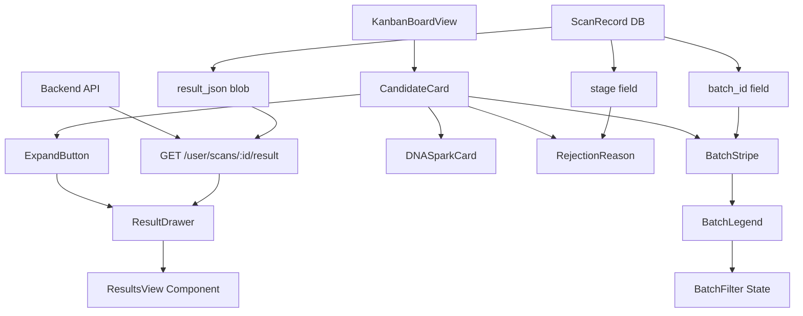
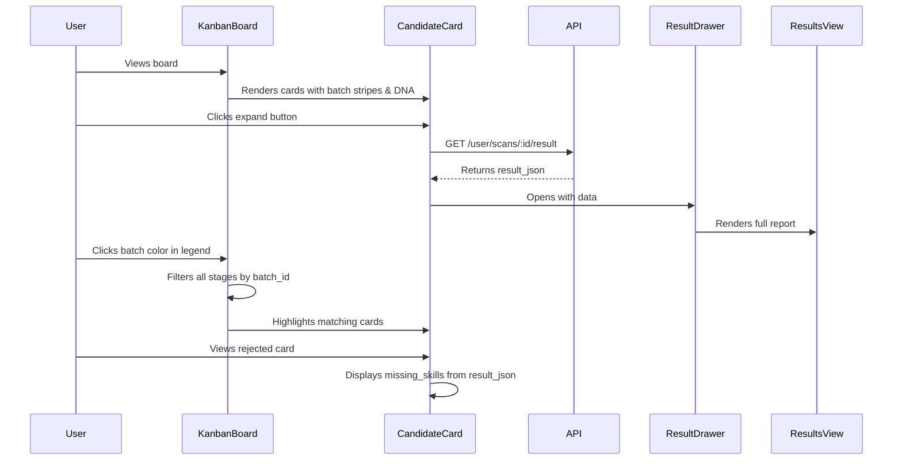

# Design Document: Kanban Enhancements Phase 1

## Overview

This feature enhances the existing Kanban board with four key improvements: (1) lazy-loaded full report viewing via drawer/modal, (2) batch cohort visual filtering with colored stripes, (3) inline candidate DNA spark-cards showing skill match scores, and (4) rejection intelligence surfacing missing skills for rejected candidates. The design leverages existing data structures (result_json blob, batch_id, stage fields) and reuses the ResultsView component for consistency.

The enhancements are designed as progressive improvements to the existing KanbanBoardView.jsx component, maintaining backward compatibility while adding new visual and interactive capabilities.

## Architecture



## Main Algorithm/Workflow



## Components and Interfaces

### Component 1: ResultDrawer

**Purpose**: Lazy-load and display full candidate report in a slide-out drawer

**Interface**:
```typescript
interface ResultDrawerProps {
  scanId: number | null
  isOpen: boolean
  onClose: () => void
  authHeaders: () => Record<string, string>
}

interface ResultDrawerState {
  loading: boolean
  error: string | null
  resultData: AnalysisResult | null
}
```

**Responsibilities**:
- Fetch result_json from API when opened
- Display loading state during fetch
- Render ResultsView component with fetched data
- Handle close action and cleanup
- Show error state if fetch fails

### Component 2: BatchStripe

**Purpose**: Visual left-border stripe indicating batch cohort

**Interface**:
```typescript
interface BatchStripeProps {
  batchId: string | null
  color: string
}

// Color mapping function
function getBatchColor(batchId: string): string
```

**Responsibilities**:
- Generate consistent color from batch_id hash
- Render 4px left border with batch color
- Provide visual cohort identification

### Component 3: BatchLegend

**Purpose**: Interactive legend showing all batches with click-to-filter

**Interface**:
```typescript
interface BatchLegendProps {
  batches: BatchInfo[]
  selectedBatch: string | null
  onBatchSelect: (batchId: string | null) => void
}

interface BatchInfo {
  batchId: string
  color: string
  count: number
  stageCounts: Record<Stage, number>
  label: string  // e.g., "March 22nd batch"
}
```

**Responsibilities**:
- Display all unique batches with colors
- Show candidate distribution across stages
- Handle batch selection for filtering
- Display summary stats (e.g., "2 in Interview, 4 Rejected")

### Component 4: DNASparkCard

**Purpose**: Inline mini-chart showing top 5 skill match scores

**Interface**:
```typescript
interface DNASparkCardProps {
  skillMatches: SkillMatch[]
}

interface SkillMatch {
  skill: string
  score: number  // 0-100
}
```

**Responsibilities**:
- Extract top 5 skills from result_json.skill_matches
- Render 5 vertical bars (mini bar chart)
- Display directly on card (no click needed)
- Provide visual fingerprint of candidate strengths

### Component 5: RejectionReason

**Purpose**: Surface missing skills for rejected candidates

**Interface**:
```typescript
interface RejectionReasonProps {
  missingSkills: string[]
  stage: string
}
```

**Responsibilities**:
- Display only when stage === "Rejected"
- Extract missing_skills from result_json
- Format as "Missing: Kubernetes, CI/CD, System Design"
- Provide pattern recognition across rejected candidates

## Data Models

### ScanRecord (Existing)

```typescript
interface ScanRecord {
  id: number
  user_id: number
  role_target: string
  fit_score: number
  file_name: string | null
  candidate_id: string | null
  result_json: string | null  // JSON blob containing full analysis
  timestamp: string
  kanban_stage: string  // "Sourced" | "Screening" | "Interview" | "Offer" | "Rejected"
  batch_id: string | null  // UUID linking batch uploads
}
```

**Validation Rules**:
- result_json must be valid JSON when present
- kanban_stage must be one of 5 valid stages
- batch_id must be UUID format when present

### AnalysisResult (Parsed from result_json)

```typescript
interface AnalysisResult {
  fit_score: number
  skill_matches: SkillMatch[]
  missing_skills: string[]
  bias_proxies: BiasProxy[]
  structured_data: StructuredData
  summary: string
  // ... other fields from existing ResultsView
}
```

**Validation Rules**:
- skill_matches array must have score 0-100
- missing_skills array contains string skill names
- All fields optional (graceful degradation)

### BatchFilterState

```typescript
interface BatchFilterState {
  selectedBatchId: string | null
  batchColorMap: Map<string, string>
  batchStats: Map<string, BatchInfo>
}
```

**Validation Rules**:
- selectedBatchId null means "show all"
- batchColorMap must have consistent colors per batch_id
- batchStats computed from current scan list

## Error Handling

### Error Scenario 1: Result Fetch Failure

**Condition**: GET /user/scans/:id/result returns 404 or 500
**Response**: Display error message in drawer: "Unable to load full report. The analysis may not be complete."
**Recovery**: Allow user to close drawer and retry; card remains functional

### Error Scenario 2: Missing result_json

**Condition**: ScanRecord has null result_json
**Response**: Disable expand button; show tooltip "Full report not available"
**Recovery**: Graceful degradation - other card features still work

### Error Scenario 3: Malformed result_json

**Condition**: result_json is not valid JSON or missing expected fields
**Response**: Show partial data with fallbacks (e.g., empty skill_matches array)
**Recovery**: Display what's available; log error for debugging

### Error Scenario 4: No Batches Present

**Condition**: All scans have null batch_id
**Response**: Hide batch legend and stripes entirely
**Recovery**: Feature gracefully disabled; board functions normally

## Correctness Properties

*A property is a characteristic or behavior that should hold true across all valid executions of a system—essentially, a formal statement about what the system should do. Properties serve as the bridge between human-readable specifications and machine-verifiable correctness guarantees.*

### Property 1: Batch Color Consistency

*For any* batch_id, the color generation function SHALL return the same color value on every invocation, and all candidate cards with the same batch_id SHALL display identical colors.

**Validates: Requirements 2.2, 2.4**

### Property 2: Batch Filtering Correctness

*For any* batch_id selection, the filtered Kanban board SHALL display only candidates whose batch_id matches the selected value, and no candidates with different batch_ids SHALL be visible.

**Validates: Requirements 3.2**

### Property 3: Filter Clear Round-Trip

*For any* set of candidates and any batch filter applied, clearing the filter SHALL restore the board to display all candidates exactly as before the filter was applied.

**Validates: Requirements 3.4**

### Property 4: Stage Distribution Accuracy

*For any* set of candidates grouped by batch_id, the stage counts displayed in the batch legend SHALL accurately reflect the number of candidates in each stage for that batch.

**Validates: Requirements 3.5**

### Property 5: Top Skills Extraction

*For any* skill_matches array with at least 5 elements, the DNA_Spark_Card SHALL extract exactly the 5 skills with the highest scores in descending order by score.

**Validates: Requirements 4.1, 4.3**

### Property 6: Missing Skills Formatting

*For any* array of missing skill strings, the Rejection_Reason component SHALL format them as a comma-separated list prefixed with "Missing: ".

**Validates: Requirements 5.2**

### Property 7: Skill Truncation

*For any* array of missing skills with more than 5 elements, the Rejection_Reason SHALL display exactly the first 5 skills followed by "..." and SHALL NOT display skills beyond the fifth.

**Validates: Requirements 5.5**

### Property 8: API Ownership Verification

*For any* combination of user_id and scan_id, the API endpoint SHALL return HTTP 200 if and only if the user_id owns the scan_id, SHALL return HTTP 403 if the scan exists but is owned by a different user, and SHALL return HTTP 404 if the scan does not exist.

**Validates: Requirements 6.2, 6.3, 6.4**

### Property 9: API Result Correctness

*For any* valid authorized request to GET /user/scans/:id/result, the API SHALL return the result_json field from the corresponding Scan_Record as valid JSON with HTTP 200 status.

**Validates: Requirements 6.5**

### Property 10: JSON Validity

*For any* Scan_Record with non-null result_json, the result_json field SHALL contain a valid JSON string that can be successfully parsed without errors.

**Validates: Requirements 7.1**

### Property 11: UUID Format Validation

*For any* Scan_Record with non-null batch_id, the batch_id SHALL match the standard UUID format (8-4-4-4-12 hexadecimal pattern).

**Validates: Requirements 7.2**

### Property 12: Stage Enum Validation

*For any* Scan_Record, the kanban_stage field SHALL contain exactly one value from the set: {"Sourced", "Screening", "Interview", "Offer", "Rejected"}.

**Validates: Requirements 7.3**

### Property 13: Skill Score Range Validation

*For any* skill_matches array in result_json, every skill match score SHALL be a number greater than or equal to 0 and less than or equal to 100.

**Validates: Requirements 7.4**

### Property 14: Graceful Degradation

*For any* Scan_Record with missing or invalid data fields (null result_json, malformed JSON, missing skill_matches, null batch_id), the Kanban board SHALL render without crashing and SHALL display available data while hiding components that depend on missing fields.

**Validates: Requirements 8.5, 10.2, 10.4, 10.5**

## Testing Strategy

### Unit Testing Approach

- **ResultDrawer**: Test loading states, error states, successful fetch, close behavior
- **BatchStripe**: Test color generation consistency, null batch_id handling
- **BatchLegend**: Test batch selection, stats calculation, empty state
- **DNASparkCard**: Test skill extraction, top-5 sorting, empty skills array
- **RejectionReason**: Test stage filtering, missing skills formatting, empty array

### Integration Testing Approach

- Test full flow: card click → API fetch → drawer open → ResultsView render
- Test batch filtering: legend click → all stages filter → card highlighting
- Test data flow: ScanRecord → parsed result_json → component props
- Test error recovery: API failure → error display → retry success

### Property-Based Testing Approach

- Minimum 100 iterations per property test
- Each property test references its design document property number
- Tag format: **Feature: kanban-enhancements-phase1, Property {number}: {property_text}**
- Use generators for: batch_ids (UUIDs), skill arrays (varying lengths), stage enums, score ranges (0-100)
- Include edge cases in generators: null values, empty arrays, boundary scores (0, 100), maximum array lengths

## Performance Considerations

- **Lazy Loading**: result_json only fetched when drawer opened (not on initial board load)
- **Batch Color Caching**: Hash-based colors computed once and cached in Map
- **Skill Extraction**: Top-5 skills extracted during card render (minimal computation)
- **Filter Performance**: Batch filtering uses simple array filter (O(n) acceptable for <1000 cards)

## Security Considerations

- **Authorization**: GET /user/scans/:id/result must verify user_id ownership
- **Data Sanitization**: result_json displayed via React (auto-escapes XSS)
- **API Rate Limiting**: Drawer fetch subject to existing API rate limits
- **PII Protection**: result_json already has PII stripped (existing system)

## Dependencies

- **Frontend**: React, lucide-react (icons), existing ResultsView component
- **Backend**: FastAPI, SQLAlchemy, existing ScanRecord model
- **Database**: PostgreSQL (existing schema, no migrations needed)
- **API**: New endpoint GET /user/scans/:id/result (returns result_json field)
