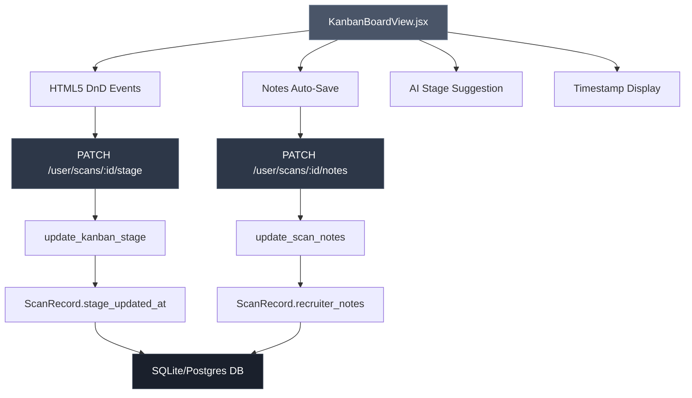
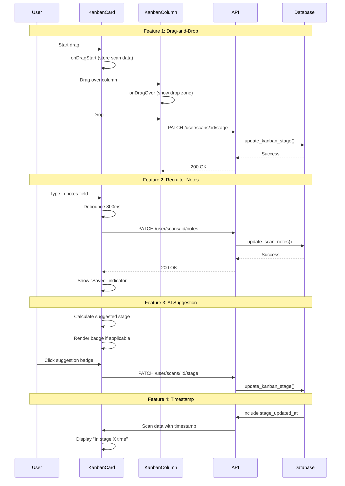

# Design Document: Kanban Pipeline Board Enhancements

## Overview

This design enhances the existing Aethel ATS Kanban board with four new features: HTML5 drag-and-drop for moving candidates between stages, per-candidate recruiter notes with auto-save, AI-suggested stage recommendations based on candidate scores, and stage-change timestamps. The implementation maintains the existing optimistic UI pattern, ownership checks, and authentication structure while adding new database columns, API endpoints, and frontend interactions.

## Architecture



## Main Algorithm/Workflow



## Components and Interfaces

### Backend: Database Layer (database.py)

#### ScanRecord Model Extensions

```python
class ScanRecord(Base):
    """Extended with notes and timestamp columns."""
    __tablename__ = "scan_records"
    
    # Existing columns...
    id: int
    user_id: int
    role_target: str
    fit_score: int
    file_name: str
    candidate_id: str
    result_json: str
    timestamp: datetime
    kanban_stage: str
    
    # NEW COLUMNS
    recruiter_notes: str | None      # TEXT, max 2000 chars
    stage_updated_at: datetime | None  # DATETIME, set on stage changes
```

**Validation Rules**:
- `recruiter_notes`: Maximum 2000 characters, nullable
- `stage_updated_at`: Automatically set when `kanban_stage` changes

#### Database Helper Functions

```python
def update_scan_notes(scan_id: int, user_id: int, notes: str) -> bool:
    """
    Update recruiter notes for a scan record.
    
    Args:
        scan_id: Primary key of ScanRecord
        user_id: Owner user ID (for ownership check)
        notes: Note text (max 2000 chars)
    
    Returns:
        True on success, False if not found or wrong user
    
    Preconditions:
        - scan_id exists in database
        - user_id matches scan record owner
        - notes length <= 2000 characters
    
    Postconditions:
        - ScanRecord.recruiter_notes is updated
        - Database transaction is committed
        - Returns True if and only if update succeeded
    """
    pass

def update_kanban_stage(scan_id: int, user_id: int, stage: str) -> bool:
    """
    Move a candidate card to a new Kanban stage (EXISTING - MODIFIED).
    
    MODIFICATION: Now also sets stage_updated_at to current UTC time.
    
    Args:
        scan_id: Primary key of ScanRecord
        user_id: Owner user ID (for ownership check)
        stage: New stage name
    
    Returns:
        True on success, False if not found or wrong user
    
    Preconditions:
        - scan_id exists in database
        - user_id matches scan record owner
        - stage is in VALID_STAGES set
    
    Postconditions:
        - ScanRecord.kanban_stage is updated to new stage
        - ScanRecord.stage_updated_at is set to current UTC time
        - Database transaction is committed
        - Returns True if and only if update succeeded
    """
    pass

def get_user_scans(user_id: int, limit: int = 20) -> list[dict]:
    """
    Return scan records for a user (EXISTING - MODIFIED).
    
    MODIFICATION: Now includes recruiter_notes and stage_updated_at in response.
    
    Args:
        user_id: User primary key
        limit: Maximum number of records to return
    
    Returns:
        List of dicts with scan data including new fields
    
    Postconditions:
        - Each dict contains: id, role_target, fit_score, file_name,
          candidate_id, timestamp, has_result, kanban_stage,
          recruiter_notes, stage_updated_at
    """
    pass
```

### Backend: API Layer (main.py)

#### Pydantic Models

```python
class ScanNotesUpdate(BaseModel):
    """Request body for updating recruiter notes."""
    notes: str  # Max 2000 chars, validated in endpoint
```

#### API Endpoints

```python
@app.patch("/user/scans/{scan_id}/notes")
async def update_scan_notes_endpoint(
    scan_id: int,
    body: ScanNotesUpdate,
    current_user: dict = Depends(get_current_user)
) -> dict:
    """
    Update recruiter notes for a scan record.
    
    Args:
        scan_id: Scan record ID from URL path
        body: Request body with notes field
        current_user: Authenticated user from JWT token
    
    Returns:
        {"ok": true, "message": "Notes updated"}
    
    Raises:
        HTTPException 400: Notes exceed 2000 characters
        HTTPException 404: Scan not found or wrong user
    
    Preconditions:
        - User is authenticated (JWT token valid)
        - scan_id exists and belongs to current_user
        - body.notes length <= 2000
    
    Postconditions:
        - ScanRecord.recruiter_notes is updated in database
        - Returns success response
    """
    pass

# EXISTING ENDPOINT (no changes needed)
@app.patch("/user/scans/{scan_id}/stage")
async def update_scan_stage_endpoint(
    scan_id: int,
    body: KanbanStageUpdate,
    current_user: dict = Depends(get_current_user)
) -> dict:
    """
    Move candidate to new Kanban stage.
    
    NOTE: Backend function update_kanban_stage() will be modified
    to also set stage_updated_at timestamp.
    """
    pass
```

### Frontend: React Components (KanbanBoardView.jsx)

#### Component Structure

```typescript
// Main component
function KanbanBoardView({ scans: initialScans }): JSX.Element

// Sub-components
function KanbanColumn({ stage, cards, onMove, movingId, onDrop, onDragOver }): JSX.Element
function CandidateCard({ scan, onMove, movingId, onNotesChange }): JSX.Element
function NotesSection({ scanId, initialNotes, onSave }): JSX.Element
function AISuggestionBadge({ scan, onAccept }): JSX.Element
```

#### State Management

```typescript
interface KanbanBoardState {
  scans: ScanRecord[]           // Current scan list
  movingId: number | null       // ID of card being moved
  moveError: string | null      // Error message from failed move
  draggedScan: ScanRecord | null // Scan being dragged
  savingNotes: Set<number>      // Set of scan IDs with notes being saved
  notesSaved: Set<number>       // Set of scan IDs with recently saved notes
}

interface ScanRecord {
  id: number
  role_target: string
  fit_score: number
  file_name: string
  candidate_id: string
  timestamp: string
  kanban_stage: string
  recruiter_notes: string | null      // NEW
  stage_updated_at: string | null     // NEW
  has_result: boolean
}
```

#### Drag-and-Drop Implementation

```typescript
// CandidateCard drag handlers
function handleDragStart(e: DragEvent, scan: ScanRecord): void {
  e.dataTransfer.effectAllowed = 'move'
  e.dataTransfer.setData('application/json', JSON.stringify(scan))
  setDraggedScan(scan)
  e.currentTarget.classList.add('opacity-50')
}

function handleDragEnd(e: DragEvent): void {
  e.currentTarget.classList.remove('opacity-50')
  setDraggedScan(null)
}

// KanbanColumn drop handlers
function handleDragOver(e: DragEvent): void {
  e.preventDefault()
  e.dataTransfer.dropEffect = 'move'
  // Add visual feedback class
}

function handleDrop(e: DragEvent, targetStage: string): void {
  e.preventDefault()
  const scanData = JSON.parse(e.dataTransfer.getData('application/json'))
  handleMove(scanData, targetStage)
}
```

**Preconditions:**
- Card must have `draggable={true}` attribute
- Drop zone must call `e.preventDefault()` in `onDragOver`

**Postconditions:**
- Dragged card moves to target column
- Optimistic UI update occurs immediately
- API call updates database
- Rollback occurs if API call fails

#### Notes Auto-Save Implementation

```typescript
function NotesSection({ scanId, initialNotes, onSave }): JSX.Element {
  const [notes, setNotes] = useState(initialNotes || '')
  const [saving, setSaving] = useState(false)
  const [saved, setSaved] = useState(false)
  const [expanded, setExpanded] = useState(false)
  
  // Debounced save function
  const debouncedSave = useMemo(
    () => debounce(async (text: string) => {
      setSaving(true)
      setSaved(false)
      try {
        await onSave(scanId, text)
        setSaved(true)
        setTimeout(() => setSaved(false), 2000)
      } catch (e) {
        console.error('Failed to save notes:', e)
      } finally {
        setSaving(false)
      }
    }, 800),
    [scanId, onSave]
  )
  
  function handleChange(e: ChangeEvent<HTMLTextAreaElement>): void {
    const text = e.target.value.slice(0, 2000) // Enforce limit
    setNotes(text)
    debouncedSave(text)
  }
  
  return (
    <div className="notes-section">
      <button onClick={() => setExpanded(!expanded)}>
        <MessageSquare /> Notes
      </button>
      {expanded && (
        <textarea
          value={notes}
          onChange={handleChange}
          maxLength={2000}
          placeholder="Add notes about this candidate..."
        />
      )}
      {saving && <span>Saving...</span>}
      {saved && <span>Saved</span>}
    </div>
  )
}
```

**Preconditions:**
- scanId is valid
- User is authenticated
- Notes length <= 2000 characters

**Postconditions:**
- Notes are saved to database after 800ms of no typing
- "Saved" indicator appears for 2 seconds after successful save
- Character limit is enforced client-side

#### AI Stage Suggestion Logic

```typescript
function calculateSuggestedStage(scan: ScanRecord): string | null {
  const score = scan.fit_score
  const currentStage = scan.kanban_stage || 'Sourced'
  const currentIdx = STAGES.indexOf(currentStage)
  
  let suggestedStage: string | null = null
  
  if (score >= 80) {
    suggestedStage = 'Interview'
  } else if (score >= 60) {
    suggestedStage = 'Screening'
  }
  
  // Only suggest if target stage is ahead of current
  if (suggestedStage) {
    const suggestedIdx = STAGES.indexOf(suggestedStage)
    if (suggestedIdx <= currentIdx) {
      return null // Don't suggest moving backward
    }
  }
  
  return suggestedStage
}

function AISuggestionBadge({ scan, onAccept }): JSX.Element | null {
  const suggested = calculateSuggestedStage(scan)
  
  if (!suggested) return null
  
  return (
    <button
      onClick={() => onAccept(scan, suggested)}
      className="ai-suggestion-badge"
    >
      AI suggests → {suggested}
    </button>
  )
}
```

**Preconditions:**
- scan.fit_score is a number between 0-100
- scan.kanban_stage is a valid stage name

**Postconditions:**
- Returns null if no suggestion applicable
- Returns stage name only if it's ahead of current stage
- Badge is clickable and triggers stage move

#### Timestamp Display

```typescript
function formatTimeInStage(stageUpdatedAt: string | null): string {
  if (!stageUpdatedAt) return 'Just added'
  
  const updated = new Date(stageUpdatedAt)
  const now = new Date()
  const diffMs = now.getTime() - updated.getTime()
  const diffDays = Math.floor(diffMs / 86400000)
  const diffHours = Math.floor(diffMs / 3600000)
  const diffMinutes = Math.floor(diffMs / 60000)
  
  if (diffMinutes < 60) return `In stage ${diffMinutes}m`
  if (diffHours < 24) return `In stage ${diffHours}h`
  if (diffDays < 7) return `In stage ${diffDays}d`
  return `In stage ${Math.floor(diffDays / 7)}w`
}
```

**Preconditions:**
- stageUpdatedAt is ISO 8601 datetime string or null

**Postconditions:**
- Returns human-readable time duration
- Formats as minutes/hours/days/weeks appropriately

## Data Models

### ScanRecord (Extended)

```python
{
  "id": 123,
  "user_id": 45,
  "role_target": "Senior Backend Engineer",
  "fit_score": 85,
  "file_name": "john_doe_resume.pdf",
  "candidate_id": "AETH-12345",
  "result_json": "{...}",
  "timestamp": "2025-01-15T10:30:00Z",
  "kanban_stage": "Screening",
  "recruiter_notes": "Strong Python skills, needs interview",  # NEW
  "stage_updated_at": "2025-01-16T14:20:00Z"  # NEW
}
```

### API Request/Response Models

#### PATCH /user/scans/:id/notes

**Request:**
```json
{
  "notes": "Candidate has excellent communication skills. Schedule phone screen."
}
```

**Response:**
```json
{
  "ok": true,
  "message": "Notes updated"
}
```

#### GET /user/scans (Modified Response)

**Response:**
```json
{
  "scans": [
    {
      "id": 123,
      "role_target": "Senior Backend Engineer",
      "fit_score": 85,
      "file_name": "resume.pdf",
      "candidate_id": "AETH-12345",
      "timestamp": "2025-01-15T10:30:00Z",
      "has_result": true,
      "kanban_stage": "Screening",
      "recruiter_notes": "Strong candidate",
      "stage_updated_at": "2025-01-16T14:20:00Z"
    }
  ]
}
```

## Correctness Properties

### Property 1: Notes persistence

*For any* valid scan record and note text under 2000 characters, saving notes then fetching the scan record should return the same note text.

**Validates: Requirements 2.5, 2.10**

### Property 2: Ownership enforcement for notes

*For any* scan record and user ID, attempting to update notes for a scan not owned by that user should fail with 404 error.

**Validates: Requirements 2.11, 7.1, 7.3, 7.4**

### Property 3: Ownership enforcement for stage changes

*For any* scan record and user ID, attempting to update stage for a scan not owned by that user should fail with 404 error.

**Validates: Requirements 7.2, 7.3, 7.4**

### Property 4: Stage timestamp update

*For any* scan record, when the kanban_stage is changed, the stage_updated_at field should be set to the current UTC time.

**Validates: Requirements 4.3**

### Property 5: AI suggestion monotonicity

*For any* candidate with a suggested stage, the suggested stage index should always be greater than the current stage index (no backward suggestions).

**Validates: Requirements 3.4**

### Property 6: AI suggestion score thresholds

*For any* candidate with fit_score >= 80, the suggested stage should be Interview; for fit_score >= 60 and < 80, the suggested stage should be Screening; for fit_score < 60, there should be no suggestion.

**Validates: Requirements 3.1, 3.2, 3.3**

### Property 7: Drag-and-drop persistence

*For any* candidate card and target stage, dropping the card onto a stage column should persist the new stage to the database.

**Validates: Requirements 1.3, 1.4**

### Property 8: Notes character limit client-side

*For any* note text exceeding 2000 characters, the client should truncate the input to exactly 2000 characters.

**Validates: Requirements 2.7, 2.8**

### Property 9: Notes character limit server-side

*For any* note text exceeding 2000 characters sent to the API, the server should reject the request with a 400 Bad Request error.

**Validates: Requirements 2.7, 2.9, 6.4**

### Property 10: Optimistic UI rollback on failure

*For any* failed API call (stage move or notes save), the UI should revert to the previous state before the operation.

**Validates: Requirements 1.5, 8.2, 8.3**

### Property 11: Timestamp display formatting

*For any* stage_updated_at timestamp, the displayed time-in-stage should use minutes for < 60min, hours for < 24h, days for < 7d, and weeks for >= 7d.

**Validates: Requirements 4.7, 4.8, 4.9, 4.10**

### Property 12: Stage change triggers API call

*For any* candidate card moved via drag-and-drop, the system should send a PATCH request to /user/scans/:id/stage with the new stage.

**Validates: Requirements 1.3, 1.4**

### Property 13: Notes debounce triggers API call

*For any* note text entered after the 800ms debounce period, the system should send a PATCH request to /user/scans/:id/notes.

**Validates: Requirements 2.4, 2.5**

### Property 14: AI suggestion click triggers stage move

*For any* applicable AI suggestion, clicking the suggestion badge should move the candidate to the suggested stage.

**Validates: Requirements 3.6**

## Error Handling

### Error Scenario 1: Notes exceed character limit

**Condition**: User attempts to save notes longer than 2000 characters
**Response**: 
- Client: Truncate input at 2000 characters (preventive)
- Server: Return 400 Bad Request if limit exceeded
**Recovery**: Display error message, allow user to edit

### Error Scenario 2: Unauthorized scan access

**Condition**: User attempts to update notes/stage for scan they don't own
**Response**: Return 404 Not Found (security: don't reveal existence)
**Recovery**: Display "Scan not found" error

### Error Scenario 3: Network failure during drag-and-drop

**Condition**: API call fails during stage move
**Response**: Rollback optimistic UI update, display error banner
**Recovery**: User can retry the move operation

### Error Scenario 4: Database connection failure

**Condition**: Database unavailable during update operation
**Response**: Return 500 Internal Server Error
**Recovery**: Display error message, suggest retry

### Error Scenario 5: Invalid stage name

**Condition**: Client sends invalid stage name in API request
**Response**: Return 400 Bad Request
**Recovery**: Client validation prevents this (defensive programming)

## Testing Strategy

### Unit Testing Approach

**Backend Tests:**
- Test `update_scan_notes()` with valid/invalid inputs
- Test `update_kanban_stage()` timestamp setting
- Test ownership checks in both functions
- Test character limit enforcement
- Test database migrations for new columns

**Frontend Tests:**
- Test drag-and-drop event handlers
- Test notes debounce logic
- Test AI suggestion calculation
- Test timestamp formatting
- Test optimistic UI updates and rollbacks

### Property-Based Testing Approach

**Property Test Library**: fast-check (JavaScript/TypeScript)

**Properties to Test:**
1. Notes round-trip: save then fetch returns same text
2. Ownership enforcement: wrong user always gets 404
3. Stage timestamp: always set on stage change
4. AI suggestion: never suggests backward movement
5. Character limit: truncation always produces valid length

### Integration Testing Approach

**End-to-End Tests:**
- Drag card between columns, verify database update
- Type notes, wait for auto-save, verify persistence
- Click AI suggestion, verify stage move
- Refresh page, verify timestamp display accuracy
- Test with multiple concurrent users (ownership isolation)

## Performance Considerations

**Debounce Strategy:**
- 800ms debounce on notes auto-save prevents excessive API calls
- Typical typing speed: 40-60 WPM = ~200-300ms per word
- 800ms allows 2-3 words before save triggers

**Drag-and-Drop Performance:**
- HTML5 native DnD has minimal overhead
- No external library dependencies
- Optimistic UI ensures perceived instant response

**Database Indexing:**
- `scan_records.user_id` already indexed (existing)
- `scan_records.kanban_stage` already indexed (existing)
- No new indexes needed for new columns

**API Response Size:**
- Adding two fields (notes, timestamp) adds ~50-200 bytes per scan
- For 100 scans: ~5-20KB additional payload
- Negligible impact on load time

## Security Considerations

**Ownership Checks:**
- All mutations (notes, stage) verify `user_id` matches authenticated user
- 404 response prevents information disclosure

**Input Validation:**
- Notes limited to 2000 characters (prevents abuse)
- Stage name validated against whitelist
- SQL injection prevented by SQLAlchemy ORM

**Authentication:**
- JWT token required for all endpoints
- Token validated via `get_current_user` dependency

**XSS Prevention:**
- React automatically escapes rendered text
- Notes displayed as plain text, not HTML

## Dependencies

**Backend:**
- SQLAlchemy (existing) - ORM for database operations
- FastAPI (existing) - API framework
- Pydantic (existing) - Request/response validation

**Frontend:**
- React 18 (existing) - UI framework
- Lucide React (existing) - Icon library (MessageSquare icon)
- Tailwind CSS (existing) - Styling

**No New Dependencies Required**
